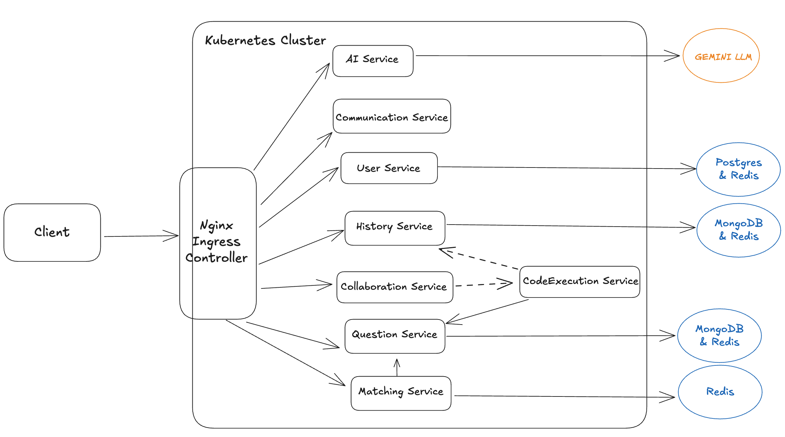

## File Structure

```shell
├── .github # GitHub workflows and issue templates
├── docker # development build scripts
├── docs # documentation
├── frontend # frontend source folder
├── kubernetes # deployment scripts
└── services # all backend services source folder
    ├── aiService
    ├── codeExecutionService
    ├── collaborationService
    ├── communicationService
    ├── historyService
    ├── matchingService
    ├── questionService
    └── userService
├── cloudbuild.yaml # script for CD
```

## Feature List

- User Profile Related:
  - Sign up
  - Sign in
  - Reset password
  - View & Update profile
  - Logout
- Matching Related:
  - Find a matching
- Collaboration Session Related:
  - View the question in Markdown format
  - Edit on a shared document
  - Cursor position awareness on the shared document
  - Editor syntax highlighting and auto completion
  - Editor CRDT algorithm
  - Switch programming language
  - Microphone communication
  - Adjust panel ratio
  - Run & Submit the code for verification
  - Translate the code to another programming language
  - View summary of attempted submissions in the collaboration session
  - View a detailed submission in the collaboration session
  - Gracefully exit the collaboration session
- Submission History Related:
  - View summary of all attempted submissions
  - View a detailed submission
- Question Related:
  - Select the most fit question given categories and difficulties.
  - Allow admins CRUD a question.
  - Support bulk insert of questions and convert to SQL statements.
- DevOps:
  - Kubernetes Cluster (GKE) for deployment.
  - Dockerfiles for building images.
  - Google Cloud Build that deploys the application on GitHub push event to master branch.
  - Rolling deployment strategy.
  - Auto horizontal and vertical scaling.
  - Nginx API gateway.

## Architecture Diagram



## Linting and Formatting

The project uses ESLint and Prettier for linting and code formatting, along with lint-staged and Husky for pre-commit checks.

Run Linters: You can run linting checks as defined in the GitHub workflow:

### For frontend

```bash
cd frontend
npm ci
npm run lint
npm run format
```

### For Node.js services (e.g., userService)

```bash
cd services/userService
npm ci
npm run lint
npm run format
```

<Note>
Pre-commit Hook: The frontend and backend services (except aiService) uses a pre-commit hook to run npx lint-staged, which automatically lints and formats staged files.

</Note>

### For aiService (Python)

```bash
cd services/aiService
pip install black isort
isort --check-only --diff --profile black .
black --check --diff .
```
